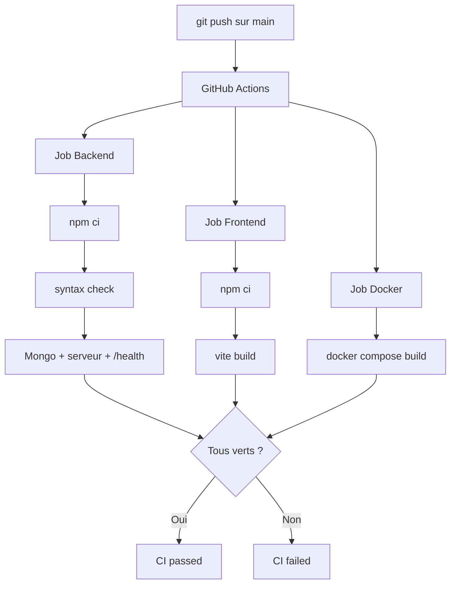

# Schéma CI — GitHub Actions

Déclenché à chaque push ou pull request sur `main`.

## Détail des jobs

| Job | Vérifications |
|-----|---------------|
| **Backend** | Install deps, syntaxe JS, démarrage serveur + Mongo, `GET /health` |
| **Frontend** | Install deps, build de production Vite |
| **Docker** | Construction des images via `docker compose build` |
